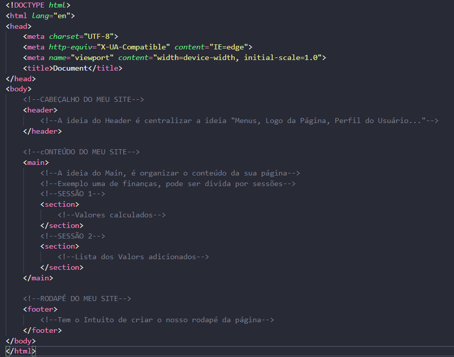
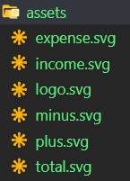

## MODELO DE CRIAÇÃO DOS ARQUIVOS

Um modelo de organização dos seus arquivos é sempre bom começar com o seguinte arquivo.

<b>index.html</b> - Focar em sempre sua página inicial, que seja a primeira pagina so seu site.

OBS: Ele serve para você trilhar todas a suas funcionalizades na páginas.

## ESTRUTURA HTML 

Ao criar um html, uma boa prática pra organizar sua página, é montar a estrutura abaixo.

## UTILIZAÇÃO DE IMAGENS

A melhor forma de ultilizar é utlizando arquivos <b>.svg</b> dessa forma a fica mais fácil de manipular as imagens no CSS.
* Exemplo:

